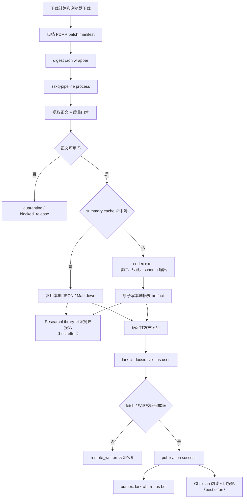

# 项目流程说明

这个项目由三条可独立理解的链路组成：

- 下载链：从知识星球筛选、下载并归档授权的 PDF。
- 摘要发布链：扫描已归档 PDF、提取正文、生成本地摘要，再发布到飞书。
- 资料库链：把 PDF、正文、摘要、飞书链接和 Obsidian 阅读入口关联起来。

这里的重点是摘要发布链已经不再依赖 OpenClaw 的 binary、旧模型注册表、
session、credential artifact 或模型配置。保留在
`openclaw_tasks/zsxq_pdf_digest/` 下的文件名只是既有 scheduler 兼容目录；
cron 仍调用 `run.cron-safe.sh -> run.sh`，而 `run.sh` 只会启动
`python -m zsxq_pipeline.cli process`。

## 1. 总体流向



一句话：只让模型读取已经提取并通过质量门禁的正文；本地 Markdown 摘要
才是发布输入真源，飞书和群消息都是可恢复的下游副作用。

每份本地摘要原子落盘后，会先尝试投影为 ResearchLibrary 中可读的永久摘要；
这个 sidecar 失败会在结果中可见，但不会撤销已提交的摘要或阻止既有 publication
恢复。Obsidian 阅读入口则只在飞书文档通过 fetch/权限校验后尝试创建，因此能够
引用已验证的文档 URL。

## 2. 分工边界

| 组件 | 负责什么 | 不负责什么 |
| --- | --- | --- |
| 下载脚本 / Chrome for Testing | 固定窗口、候选计划、授权下载和归档 | 摘要、飞书写入 |
| `run.cron-safe.sh` | 按既有日历唤醒任务、日志轮转、避免重叠触发 | 执行摘要模型或飞书 API |
| `run.sh` | 读取任务本地配置并转交 Python pipeline | 快照 agent、清 session、同步 auth |
| `zsxq_pipeline.extract` | 文本提取、OCR fallback、正文质量门禁 | 让模型直接读 PDF |
| `zsxq_pipeline.providers.codex` | 通过固定 argv 调用 `codex exec` | 访问浏览器、飞书、仓库写入、外部事实 |
| `zsxq_pipeline.publish` / `lark` | 确定性分组、文档创建/追加/fetch/授权 | 重做摘要 |
| `zsxq_pipeline.notify` | 以幂等键投递低噪声群消息 | 回滚已成功发布的文档 |
| SQLite state | stage lease、artifact identity、publication、outbox | 保存 PDF 正文或取代本地 Markdown |

## 3. 摘要阶段

每份 PDF 都先走 `pdftotext`、清理、质量门禁和必要时本地 OCR。PDF 本体
不会传给模型。成功文本以 `pdf_sha256 + extractor_version` 为键缓存。

未命中摘要缓存时，pipeline 为一个 PDF 建立一个受控输入目录，并以 argv
数组运行：

```text
codex exec --ephemeral --ignore-user-config --ignore-rules \
  --sandbox read-only --model <configured-model> \
  --output-schema <summary.schema.json> \
  --output-last-message <result.json> -
```

调用有独立进程组和硬超时，超时后先 TERM 再 KILL。仅接受与
`summary.schema.json` 完全匹配的最终 JSON；stdout 只用于诊断和用量。
没有 OpenClaw 或第二个模型 provider 的运行时 fallback。

摘要 cache identity 至少包含：PDF SHA-256、extractor 版本、prompt
版本/内容 hash、模型和 reasoning。最多两个摘要 worker 可以并行；即使
完成先后不同，后续发布顺序仍按 source、日期和文件身份固定。

正文质量不够的文件进入 `quarantine`，环境/工具/认证问题进入相应的
blocked 或 retry 状态。一个坏 PDF 不应阻塞同批其余文件。

## 4. 飞书文档与通知

发布只接受已原子落盘的本地 JSON/Markdown 摘要。它按
`DOC_GROUP_SIZE`、`DOC_GROUP_THRESHOLD` 和单文档容量做确定性分组，并
串行写入飞书：

1. `lark-cli docs +create` 或 `+update` 以 `--as user` 写文档。
2. 远端正文写成功后立即记录 `remote_written`。
3. 设置/核对标题，使用 `docs +fetch --as user` 验证正文锚点，并以
   `drive ... --as user` 向目标 chat 授予 view 权限。
4. 以上校验都通过后才记录 `success` 并确认 document 的 publish stage。

所以如果 create 或 append 已成功，但标题、fetch 或权限步骤前进程退出，
下次只会从原记录的文档 URL 做 verify/grant，不会再创建或追加同一正文。

群通知与业务事务分离。`lark-cli im +messages-send --as bot` 必须附稳定
idempotency key；消息失败只留在 notification outbox 里按退避重试，不撤销
已成功的文档。每份文档链接优先于批次终态消息投递。

`LARKSUITE_CLI_CONFIG_DIR` 可以继续指向已有已验证的 profile，即使路径名
含有 `openclaw`；这只是 profile 的历史名字，本 PR 不迁移或删除它。

## 5. 运行状态和真相源

| 位置 | 用途 | 是否决定完成 |
| --- | --- | --- |
| `pipeline.sqlite3` | source/document identity、stage、publication、outbox | 是，事务状态真相 |
| `text_cache/` | 复用已验证的正文 | 否，artifact 缓存 |
| `summary_cache/` | 复用 JSON/Markdown 摘要 | 否，artifact 缓存 |
| `run_status.json` | 兼容旧运维界面的实时状态导出 | 否，展示 |
| `last_result.json` / `.md` | 本轮结果导出 | 否，展示 |
| `pending_batch.json` | 兼容扫描输入/本轮清单 | 否，输入记录 |
| 飞书文档 / 群消息 | 远端展示和通知 | 否，需回写/校验 |

publication 的唯一正确恢复顺序是 `intent -> remote_written -> success`。
通知 outbox 有自己的幂等键、retry 和 dead-letter 记录。不要通过删除缓存、
`publish_records`、outbox 或历史摘要来“重试”。

## 6. 常用操作

以下命令只操作本机；`--preflight-only` 只检查 capability，不会创建飞书
文档、发送消息或运行真实 Codex canary：

| 目标 | 命令 |
| --- | --- |
| 手动跑 digest | `bash "${DIGEST_TASK_DIR}/run.cron-safe.sh"` |
| 预检 | `bash "${DIGEST_TASK_DIR}/run.sh" --preflight-only --no-notify` |
| 总结一个 PDF | `bash "${DIGEST_TASK_DIR}/run.sh" --file "/absolute/path/to/file.pdf"` |
| 总结一个文件夹 | `bash "${DIGEST_TASK_DIR}/run.sh" --folder "/absolute/path/to/folder"` |
| 仅做摘要、不发布 | `bash "${DIGEST_TASK_DIR}/run.sh" --summary-only --no-notify --file "/absolute/path/to/file.pdf"` |
| 只做本地 dry run | `bash "${DIGEST_TASK_DIR}/run.sh" --dry-run --no-notify --file "/absolute/path/to/file.pdf"` |

将 `${DIGEST_TASK_DIR}` 替换为实际 cron 任务目录（常见的既有路径是
`${OPENCLAW_TASKS_ROOT}/ZSXQ_pdf_digest`）。目录名称不表示 pipeline 要求
安装或运行 OpenClaw。

## 7. 故障处理原则

| 现象 | 正确动作 |
| --- | --- |
| PDF 正文不可用 | 查看 quarantine 结论，修复内容或人工处理；不要要求模型猜测 |
| Codex schema 不合法 | 不写摘要 artifact，不进入 publish；检查固定 prompt/schema 和结果 |
| Codex 认证或本地 binary 失败 | 标记 blocked/retry，修复本机 Codex 后重跑；不要配置 OpenClaw agent fallback |
| create/append 后 fetch 失败 | 保留 `remote_written`，下次验证既有 URL，绝不重复写正文 |
| 群通知失败 | 检查 outbox；publication 保持成功，后续调度会独立重试 |
| 摘要缓存命中 | 不应启动 Codex 子进程；直接进入确定性发布 |

真实 Codex smoke、真实飞书文档和群消息均需要单独明确授权。本 PR 的预检和
自动化测试不会执行这些外部写入。
