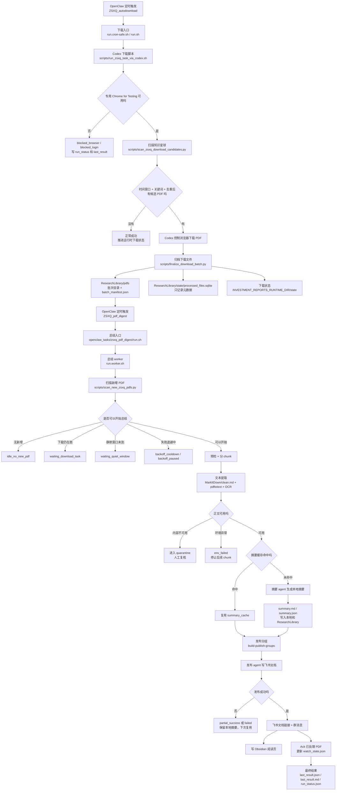
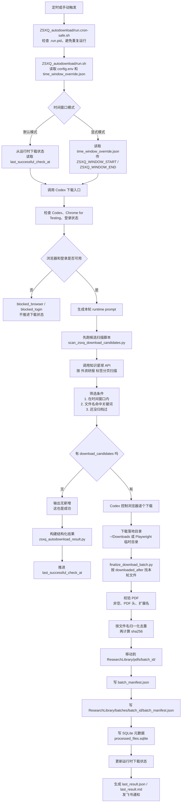
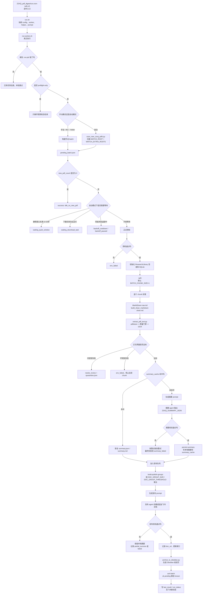
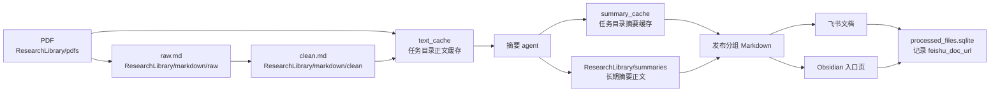

# ZSXQ 外资研报项目全流程图

本文描述当前项目真实流程，范围是：

- 下载链：从知识星球筛选、下载 PDF，并归档到本地资料库。
- 总结链：监听新增 PDF，提取正文，生成本地摘要，发布到飞书。
- 资料库链：把 PDF、正文、摘要、飞书链接、Obsidian 阅读页串起来。
- 运行状态：哪些文件才是真实状态，遇到失败时看哪里。

几个术语先说明：

- OpenClaw：本机定时任务和消息机器人，负责按时触发、发飞书消息。
- Codex：负责执行本地脚本、控制浏览器、整理结果。
- Agent：OpenClaw 里的专用自动助手。这里有摘要 agent 和飞书发布 agent。
- Chunk：小批次。默认 1 个 PDF 一个 chunk，避免一个坏文件拖住整轮。
- OCR：把扫描版 PDF 的图片内容识别成文字。
- Ack：确认已处理。确认后，这些 PDF 不会在下一轮重复总结。

## 1. 一张总览图

一句话理解：

> 这个项目先从知识星球把符合条件的 PDF 抓到 ResearchLibrary，再由总结任务把 PDF 变成可读正文和摘要，最后发布到飞书，并把本地资料库、Obsidian、状态文件一起补齐。

## 2. 执行主体分工

| 角色 | 做什么 | 不做什么 | 关键位置 |
| --- | --- | --- | --- |
| OpenClaw 下载任务 | 按时触发下载链、读取显式时间窗、把结果发回飞书 | 不直接控制浏览器细节 | `${OPENCLAW_TASKS_ROOT}/ZSXQ_autodownload` |
| Codex 下载脚本 | 启动/复用专用浏览器，扫描候选，执行下载，调用归档脚本 | 不负责摘要和飞书文档发布 | `scripts/run_zsxq_task_via_codex.sh` |
| Chrome for Testing | 保留知识星球登录态，给 Codex 控制 | 不使用日常 Chrome | `~/.openclaw/browser-profiles/zsxq-cft` |
| 归档脚本 | 找到本轮下载的 PDF，校验 PDF，移动到资料库，写 manifest 和状态 | 不决定飞书发布 | `scripts/finalize_download_batch.py` |
| OpenClaw 总结任务 | 每 10 分钟扫描新增 PDF，等待下载稳定后启动总结 | 不直接下载知识星球 PDF | `${OPENCLAW_TASKS_ROOT}/ZSXQ_pdf_digest` |
| 摘要 agent | 只读正文文本，输出结构化摘要 | 不读 PDF，不写飞书 | `zsxq_pdf_digest_summary` |
| 发布 agent | 只读本地摘要，创建或追加飞书文档 | 不重新总结，不重新读 PDF | `zsxq_pdf_digest_publish` |
| ResearchLibrary | 存 PDF、正文、摘要、索引和批次清单 | 不作为运行调度真相 | `${RESEARCH_LIBRARY_ROOT}` |
| Obsidian | 生成给人阅读的入口页 | 不作为摘要正文真源 | `${OBSIDIAN_VAULT_ROOT}` |

## 3. 下载链详细流程

下载链的关键规则：

| 规则 | 当前实现 |
| --- | --- |
| 目标页面 | 知识星球 `前沿信息收录 -> 外资研报` |
| 默认时间窗 | 上次成功检查时间到本次运行时间 |
| 补抓时间窗 | `time_window_override.json` 指定，成功后可自动关闭 |
| 关键词真源 | `config/local/interest_keywords.json` |
| 临时关注项 | `${INVESTMENT_REPORTS_RUNTIME_DIR}/state/zsxq_focus_runtime_state.json` |
| 下载暂存 | `${DOWNLOADS_DIR}`，也兼容 Playwright 临时目录 |
| 当前主归档 | `${RESEARCH_LIBRARY_ROOT}/pdfs` |
| 旧归档兼容 | `${DOWNLOADS_DIR}/ZSXQ-外资研报` 仍被总结任务监听 |
| 下载状态真相 | `${INVESTMENT_REPORTS_RUNTIME_DIR}/state/zsxq_foreign_reports_state.json` |
| 归档目录名 | `YYYY-MM-DD_HH-MM-SS__to__YYYY-MM-DD_HH-MM-SS` |
| PDF 唯一性 | 优先用 `pdf_sha256`，同时做文件名归一化去重 |

## 4. 总结链详细流程

总结链的关键规则：

| 规则 | 当前实现 |
| --- | --- |
| 扫描根目录 | `WATCH_ROOT=${DOWNLOADS_DIR}/ZSXQ-外资研报` |
| 额外扫描根目录 | `WATCH_EXTRA_ROOTS=${RESEARCH_LIBRARY_ROOT}/pdfs` |
| 静默窗口 | 最近 PDF 写入后满 15 分钟才开始 |
| 下载联动 | 如果 `ZSXQ_autodownload` 还在跑，总结任务先等 |
| 摘要分批 | `BATCH_CHUNK_SIZE=1`，默认一篇 PDF 一个摘要 chunk |
| 发布分组 | `DOC_GROUP_SIZE=10`，超过 `DOC_GROUP_THRESHOLD=15` 时拆成多份飞书文档 |
| 摘要模型 | `zsxq_pdf_digest_summary`，默认 thinking 为 `medium` |
| 发布模型 | `zsxq_pdf_digest_publish`，默认 thinking 为 `off` |
| 文本缓存 | `text_cache/`，复用已提取正文 |
| 摘要缓存 | `summary_cache/`，飞书失败后下次可直接复用摘要 |
| 内容失败 | 进入 `quarantine.json`，不盲目重复跑 |
| 状态确认 | 飞书发布成功或内容失败隔离后，才 ack |

## 5. 文本、摘要、发布的产物流向

重点：

- `raw.md` 是 MarkItDown 直接转出的原始 Markdown。
- `clean.md` 是清理水印、整理长行后的正文候选。
- `extract_pdf_text.py` 仍是进入摘要前的质量门禁，不能跳过。
- `summary_cache/` 是任务运行缓存，解决重跑效率。
- `ResearchLibrary/summaries/` 是长期可读摘要正文。
- Obsidian note 是阅读入口，不是摘要正文的唯一真源。
- SQLite 只记录索引和元数据，不决定任务是否继续跑。

## 6. 状态文件地图

| 文件 | 谁写入 | 什么时候看 | 含义 |
| --- | --- | --- | --- |
| `${INVESTMENT_REPORTS_RUNTIME_DIR}/state/zsxq_foreign_reports_state.json` | 下载链 | 判断下次从哪个时间点继续下载 | 下载链最重要状态 |
| `logs/zsxq_last_run_structured.json` | Codex 下载脚本 | 看最近一次下载结构化结果 | 下载结果的标准汇总 |
| `ZSXQ_autodownload/run_status.json` | 下载链 | 看下载任务是否正在跑、卡在哪 | 下载实时状态 |
| `ZSXQ_autodownload/last_result.json` | 下载链 | 看下载最终结果 | 给 OpenClaw 和人看的结果 |
| `ZSXQ_pdf_digest/watch_state.json` | 总结链扫描器 | 判断哪些 PDF 已知、哪些仍待处理 | 总结扫描基线 |
| `ZSXQ_pdf_digest/pending_batch.json` | 总结链扫描器 | 看本轮待总结 PDF 列表 | 总结任务输入 |
| `ZSXQ_pdf_digest/run_status.json` | 总结 worker | 看当前 phase、chunk、心跳、发布数量 | 总结实时状态 |
| `ZSXQ_pdf_digest/last_result.json` | 总结 worker | 看本轮最终结果 | 总结最终状态 |
| `ZSXQ_pdf_digest/last_result.md` | 总结 worker | 看给人读的最终摘要 | 飞书消息内容来源 |
| `ZSXQ_pdf_digest/last_usage_summary.json` | 总结 worker | 看 agent 调用消耗 | 统计用 |
| `ZSXQ_pdf_digest/failure_backoff.json` | 总结 worker | 同一批反复失败时看 | 自动退避状态 |
| `ZSXQ_pdf_digest/quarantine.json` | 总结 worker | 内容型失败时看 | 被隔离文件清单 |
| `ResearchLibrary/state/processed_files.sqlite` | 多个脚本 | 查 report_id、sha256、路径、飞书链接 | 资料库索引，不是运行真相 |

看运行状态时的优先级：

1. 当前是否在跑：先看 `run_status.json`。
2. 最终是否成功：再看 `last_result.json` 或 `last_result.md`。
3. 下载链是否推进：看 `${INVESTMENT_REPORTS_RUNTIME_DIR}/state/zsxq_foreign_reports_state.json`。
4. 总结链为什么没处理：看 `watch_state.json`、`pending_batch.json`、`failure_backoff.json`。
5. 飞书发布是否卡住：看 `cron.log` 和 `run_status.json` 的 `phase / published_count / waiting_reason`。

## 7. 主要异常分支

| 场景 | 结果状态 | 根本原因 | 下一步 |
| --- | --- | --- | --- |
| Chrome for Testing 不可用 | `blocked_browser` | 专用浏览器没启动、端口不可用或路径错误 | 检查 CFT 路径和 9223 端口 |
| 知识星球登录失效 | `blocked_login` / `need_reauth` | 专用 profile 需要重新登录 | 打开专用 CFT 登录知识星球 |
| API 扫描失败 | `api_unavailable_dom_fallback` 或失败 | 知识星球接口不可用或返回异常 | 看 `scan_mode` 和 `api_probe_status` |
| 无新增 PDF | `success` / `idle_no_new_pdf` | 时间窗内无命中，或已下载过 | 这是正常结果，不是失败 |
| 下载有候选但归档没文件 | `partial` 或下载不完整 | 浏览器下载没完成，或落在临时目录 | 看 `extra_staging_dirs` 和下载日志 |
| 总结任务一直 waiting | `waiting_quiet_window` | 新文件还在写入或刚下载完 | 等静默窗口满 15 分钟 |
| 下载任务未结束 | `waiting_download_task` | 下载链还在跑 | 先看下载任务 `run_status.json` |
| PDF 正文不可用 | `needs_review` / quarantine | PDF 可能是损坏、加密、扫描质量太差 | 看 `quarantine_report.md` 后人工处理 |
| OCR 或本机工具坏了 | `env_failed` | `pdftotext`、`ocrmypdf`、`tesseract` 或临时目录异常 | 先修环境，不要重跑同一批 |
| 摘要 agent 超时 | `partial_success` 或重试后恢复 | 单篇太长或 agent 卡住 | worker 会本地强制超时并重试一次 |
| 飞书发布失败 | `partial_success` | 飞书授权、权限、网络或发布 agent 失败 | 本地摘要已保留，下次优先复用 |
| Ack 失败 | `ack_failed` | 已发布但扫描状态未确认 | 修状态回写，否则可能重复处理 |

## 8. 日常操作入口

| 目标 | 命令或文件 |
| --- | --- |
| 手动跑下载任务 | `bash ${OPENCLAW_TASKS_ROOT}/ZSXQ_autodownload/run.cron-safe.sh` |
| 指定时间窗补抓 | 改 `${OPENCLAW_TASKS_ROOT}/ZSXQ_autodownload/time_window_override.json` 后触发下载 |
| 手动跑总结任务 | `bash ${OPENCLAW_TASKS_ROOT}/ZSXQ_pdf_digest/run.cron-safe.sh` |
| 只做总结预检 | `bash ${OPENCLAW_TASKS_ROOT}/ZSXQ_pdf_digest/run.sh --preflight-only` |
| 总结单个 PDF | `bash ${OPENCLAW_TASKS_ROOT}/ZSXQ_pdf_digest/run.sh --file "/absolute/path/to/file.pdf"` |
| 只跑到文本和摘要 prompt | `bash ${OPENCLAW_TASKS_ROOT}/ZSXQ_pdf_digest/run.sh --dry-run --file "/absolute/path/to/file.pdf"` |
| 长期改关键词 | `config/local/interest_keywords.json` |
| 临时改关注项 | `scripts/update_zsxq_focus.py` 或 `${INVESTMENT_REPORTS_RUNTIME_DIR}/state/zsxq_focus_runtime_state.json` |
| 看下载最终状态 | `${OPENCLAW_TASKS_ROOT}/ZSXQ_autodownload/last_result.json` |
| 看总结实时状态 | `${OPENCLAW_TASKS_ROOT}/ZSXQ_pdf_digest/run_status.json` |
| 看总结最终状态 | `${OPENCLAW_TASKS_ROOT}/ZSXQ_pdf_digest/last_result.json` |
| 看资料库索引 | `${RESEARCH_LIBRARY_ROOT}/state/processed_files.sqlite` |

## 9. 当前项目边界

这份图表按当前项目状态整理：

- 当前主线只有 ZSXQ 下载链和 `zsxq_pdf_digest` 总结/发布链。
- 历史上的 `chatgpt_pdf_agent/` 已不属于当前主流程。
- `ResearchLibrary/state/processed_files.sqlite` 只是索引，不替代 `run_status.json`、`last_result.json`、`watch_state.json` 这些运行状态文件。
- 摘要分批和飞书发布分组是两件事：`BATCH_CHUNK_SIZE` 管摘要，`DOC_GROUP_SIZE / DOC_GROUP_THRESHOLD` 管飞书文档数量。
- 下载链成功后，即使没有新文件，也可以推进下载时间窗；这不是异常。
- 总结链只有在飞书发布成功或内容失败隔离后，才会确认已处理，防止半成品被误标完成。
