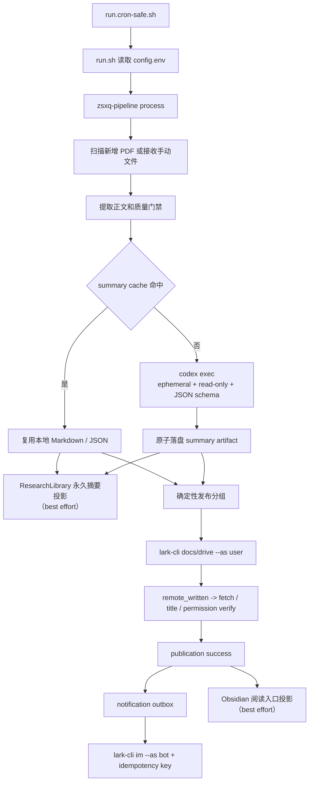

# ZSXQ PDF Digest Workflow

这份文档说明当前真实链路。既有 cron wrapper 保留，但从 `run.sh` 开始的业务
执行完全由 Python pipeline、`codex exec` 和 `lark-cli` 组成。



## 1. 入口与预检

`run.sh` 不再快照 worker、agent auth、session 或 registry。它读取实际任务目录
的 `config.env`，设置 release checkout 的 `PYTHONPATH`，并转交：

```text
python -m zsxq_pipeline.cli process --runtime-root <actual-task-dir> <user-args>
```

`--preflight-only` 只检查本机 command capability 和配置形状。它不会启动真实
Codex 请求、创建飞书文档或发送群消息。建议在 scheduler 启用前运行：

```bash
bash "${DIGEST_TASK_DIR}/run.sh" --preflight-only --no-notify
```

## 2. 提取和摘要

1. pipeline 扫描 eligible PDF，或接收 `--file` / `--folder`。
2. 现有 extractor 负责 `pdftotext`、清理、质量门禁和必要的 OCR fallback。
3. 通过门禁的正文以 `pdf_sha256 + extractor_version` 缓存；不能形成可信正文的
   文件进入 quarantine，不交给模型。
4. 每个缺失摘要的 PDF 建立一个受控 job。提示词、正文输入、结果路径都只位于
   本次工作目录；模型不读取 PDF、浏览器或飞书。
5. `CodexSummaryProvider` 以 argv（不是 shell）执行：

   ```text
   codex exec --ephemeral --ignore-user-config --ignore-rules \
     --sandbox read-only --model <model> \
     --output-schema <summary.schema.json> \
     --output-last-message <result.json> -
   ```

   已审批的 `CODEX_REASONING` 也通过本次调用的显式 Codex config override
   传入；它和模型、prompt hash 一起进入 cache identity，绝不依赖用户全局配置。

6. 调用有独立 process group、硬超时、TERM/KILL 清理。只接受与 schema 完全
   一致的 final output；无效输出不写 summary artifact。
7. 成功结果先原子写 JSON/Markdown，再提交 summary stage。随后尝试把同一
   Markdown 投影为 ResearchLibrary 的可读永久摘要；该 sidecar 失败会被记录，
   但不会撤销摘要 artifact。cache key 包含 PDF hash、extractor 版本、prompt
   版本/hash、model 和 reasoning。

默认一份 PDF 一个 job，最多两个 summary worker 并行。没有运行时 provider
fallback，也不允许退回 OpenClaw agent。

## 3. 发布

摘要 job 可以并发结束，但 publish group 总是按 source/date/file identity 的固定
顺序生成。`DOC_GROUP_SIZE`、`DOC_GROUP_THRESHOLD` 和单文档容量决定分区。

对每个 group：

1. 从本地 Markdown artifact 生成正文；它是唯一的 publish 输入真源。
2. 以 `lark-cli docs ... --as user` create 或 append。
3. 远端正文写成功后立即记为 `remote_written`，保存 document URL。
4. 校验标题，`docs +fetch --as user` 验证正文锚点，以 `drive ... --as user`
   给目标 chat 授予 view 权限。
5. 验证完成后才记为 `success` 并确认 publish stage。
6. 仅在该成功状态后，尝试创建或更新带已验证飞书 URL 的 Obsidian 阅读入口；
   sidecar 失败可见，但不会回滚 publication。

若第 3 步已完成而第 4 步失败，下一次只能用保存的 URL 做 fetch/verify/grant。
不得重复 create 或 append，同一 PDF 也不得因 publish 失败而重新总结。

## 4. 通知

document success 会写入 durable notification outbox。drain outbox 时：

- `lark-cli im +messages-send --as bot` 必须带稳定 idempotency key；
- 文档链接通知必须先于 batch terminal 通知；
- 通知失败只记录 retry/dead-letter 状态，不撤销 publication success；
- 每轮默认只尝试一次，后续 cron 触发再按退避重试。

用户身份和机器人身份不能互换。现有 `LARKSUITE_CLI_CONFIG_DIR` 只是 lark-cli
profile 位置；即使旧目录名含 `openclaw`，也不应在本迁移中重命名、复制或删除。

## 5. 状态与恢复

SQLite database 记录 artifact identity、stage lease、publication 和 outbox。
`run_status.json`、`last_result.json`、`last_result.md` 是兼容运维导出，不是
事务真相。恢复优先级如下：

1. summary cache 命中：复用 artifact，不执行 Codex。
2. ResearchLibrary 投影失败：保留本地 artifact，修复 sidecar 后可单独补齐，
   不重新调用 Codex。
3. publication `remote_written`：验证已有 URL，不重复远端写入。
4. publication `success` 而通知未送达：仅 drain outbox。
5. content failure：保留 quarantine；不让无效 PDF 无限重跑。

`run.cron-safe.sh` 暂时继续持有 scheduler/日志/重叠保护，直至后续统一调度
变更。不要删除它、不要手工删除 runtime state 来强制恢复，也不要把真实外部
canary 包含在预检或自动化测试中。
