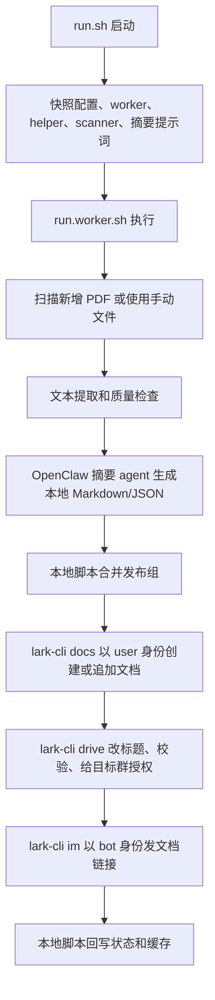

# ZSXQ PDF 总结任务执行流程

这份文档只说明当前真实链路。现在的分工是：

- OpenClaw 只负责读正文并生成本地摘要。
- 本地脚本负责分批、缓存、状态回写和失败处理。
- `lark-cli docs/drive` 负责创建、追加、改标题和授权飞书文档。
- `lark-cli im` 负责把文档链接发到目标群。

## 1. 整体图

## 2. 文件分工

- [config.env.example](config.env.example)：本地配置模板。
- [run.sh](run.sh)：稳定入口，先快照再启动 worker。
- [run.worker.sh](run.worker.sh)：主流程。
- [summary_prompt.md](summary_prompt.md)：摘要提示词。
- [summary_system_prompt.md](summary_system_prompt.md)：摘要阶段 system prompt。
- [extract_pdf_text.py](extract_pdf_text.py)：PDF 文本提取。
- [manage_zsxq_digest_batch.py](../../scripts/manage_zsxq_digest_batch.py)：分批、渲染摘要 prompt、摘要校验、缓存、发布 key、飞书 URL 解析。
- [scan_new_zsxq_pdfs.py](../../scripts/scan_new_zsxq_pdfs.py)：扫描新增 PDF，并在成功后确认已处理。

## 3. 启动和预检

`run.sh` 会先复制这一轮需要的文件到临时目录，再启动快照版 worker。这样任务跑到一半时，仓库里的代码或配置被修改，也不会撕裂当前这一轮。

快照内容包括：

- `config.env`
- `run.worker.sh`
- `manage_zsxq_digest_batch.py`
- `scan_new_zsxq_pdfs.py`
- `extract_pdf_text.py`
- `summary_prompt.md`
- `summary_system_prompt.md`

预检会确认 Python、OpenClaw、helper、scanner、摘要提示词、文本提取脚本、MarkItDown 和缓存目录是否可用。

## 4. 摘要阶段

每个 chunk 的顺序是：

1. 先跑本地文本提取。
2. 文本质量不够时，按 OCR fallback 继续尝试。
3. 内容型失败写入隔离清单。
4. 环境型失败会停止本轮后续处理。
5. 如果命中 `summary_cache/`，直接复用本地摘要。
6. 没命中缓存时，用 `summary_prompt.md` 和 `summary_system_prompt.md` 调用摘要 agent。
7. 摘要输出必须通过 `validate-summary`。
8. 摘要通过后落盘为 `.summary.json` 和 `.summary.md`，并写入缓存。

摘要 agent 每次调用前后都会清会话，避免上一个 PDF 的上下文影响下一个 PDF。

## 5. 飞书发布阶段

摘要落盘后先进入发布队列。长批次中，队列每攒够 `DOC_GROUP_SIZE` 份摘要就会先发布一份飞书文档；收尾时再发布不足一组的剩余摘要。发布只走 `lark-cli`：

1. 每个新文档用 `docs +create --as user` 创建。
2. 创建后用 `drive files patch --as user` 修正文档文件标题。
3. 用 `drive +inspect --as user` 校验标题。
4. 用 `docs +fetch --as user` 校验文档可读。
5. 用 `drive permission.members create --as user` 给目标群授权。
6. 若当前发布组明确复用已有目标文档，则用 `docs +update --command append --as user` 追加。

`publish_records.jsonl` 会保留成功发布记录，用来防止重跑时重复创建同一份文档。它不是第二发布链路。

如果 `lark-cli docs/drive` 任一步失败，本轮发布阶段直接失败，失败原因会写入：

- `last_result.json`
- `run_status.json`
- `cron.log`

## 6. 群通知阶段

群通知只走 `lark-cli im +messages-send`。

- 发送身份：`LARK_CLI_SEND_AS=bot`
- 文档创建/追加身份：`PUBLISH_LARK_CLI_AS=user`
- 每条通知都有稳定 idempotency key，避免成功消息重复发送。
- 如果 `lark-cli im` 失败，只记录 `channel=lark-cli`、`status=failed` 和错误原因，不会换其他发送者。

当前保留的群消息主要是：

- 开始处理
- 文档完成卡片
- 等待、busy、失败等必要状态

没有新增 PDF 时只写本地状态，不发群提醒。

## 7. 状态和缓存

常用运行态文件：

- `run_status.json`：当前或最近一次运行状态。
- `last_result.json`：最近一次结构化结果。
- `last_result.md`：最近一次给人看的结果摘要。
- `cron.log`：完整日志。
- `notification_messages.jsonl`：通知发送记录。
- `publish_records.jsonl`：发布去重记录。
- `failure_backoff.json`：同一批文件失败退避状态。
- `quarantine.json`：内容型失败隔离清单。
- `text_cache/`：正文缓存。
- `summary_cache/`：摘要缓存。

## 8. 保留的安全机制

这些不是多发布者兜底，仍然保留：

- 运行锁：避免 cron 和手动运行互相覆盖。
- 静默窗口：避免文件刚写入一半就开始处理。
- 下载任务检查：下载任务还在跑时先等待。
- 失败退避：`EOF`、超时、断流等临时网络故障按 `5/10/20` 分钟快速重试并在第 4 次失败后暂停；权限、认证、配置及其他故障按 `30/60` 分钟重试并在第 3 次失败后暂停。
- 正文缓存和摘要缓存：减少重复处理。
- 发布记录：避免重复创建文档。
- OCR fallback：处理 PDF 质量问题。
